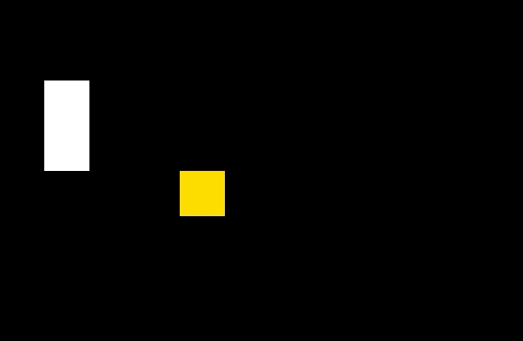

<h1 align=center>SNAKE GAME | MADE IN RUBY </h1>
<br />
Game using Ruby2D Gem.
<br />

# How to run?
Dowloand the project and follow the steps below:

```bash
# Inside project folder
bundle install
ruby {folder path}/src/app.rb
```
<br />
Preview
<div align=center>


</div>